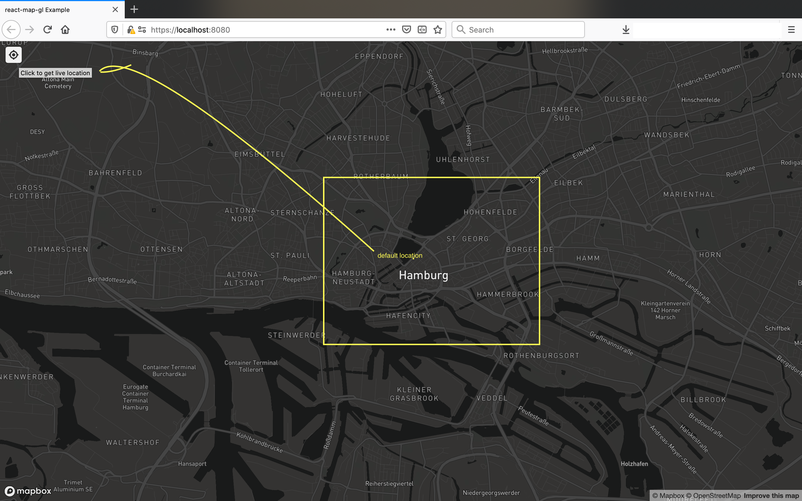

**Live Location window with https enabled, using Mapbox and React.**

What you'll need to do get it up and running:

0 - Clone the repo and cd to the project folder

1 - create an .env file to keep your environment variables.

​	$ touch .env

 

Reuse .env.sample and paste your Mapbox project's public key to be the set as environment variable (MAPBOX_PUBLIC_KEY) value.

2 - Generate self-signed certificate files for development purpose

*https://docs.mapbox.com/mapbox-gl-js/api/#geolocatecontrol :* 

*Not all browsers support geolocation, and some users may disable the feature. Geolocation support for modern browsers  including Chrome requires sites to be served over HTTPS. If geolocation support is not available, the GeolocateControl will not be visible.*

 a) Create a folder named certs in your project root folder.

​	$ mkdir certs

​	This directory will contain your self-signed certificates. ( server.crt, server.key , ca.pem )

b) Make sure you have openssl installed and on your path

c) Follow the steps below to generate the certificate files:

​	to generate server.crt and server.key : 

​	https://devcenter.heroku.com/articles/ssl-certificate-self

​	to generate .pem file from existing certificate files 

​	https://support.microfocus.com/kb/doc.php?id=7013103#

\----------------------------------------------------------------------------------------

d) (optional) We have already included security related configuration 

​	in devServer configuration block in webpack.config.js file. 

​	[edit to change the paths to the cert related files.]

e) (optional) To allow invalid certificates for resources loaded from localhost, 

​	just paste it to chrome address bar and enable it for local testing purpose.

​	chrome://flags/#allow-insecure-localhost

\----------------------------------------------------------------------------------------

3) To install the dependencies and serve the app (at the project root);

​	$ npm install

​	$ npm start

 